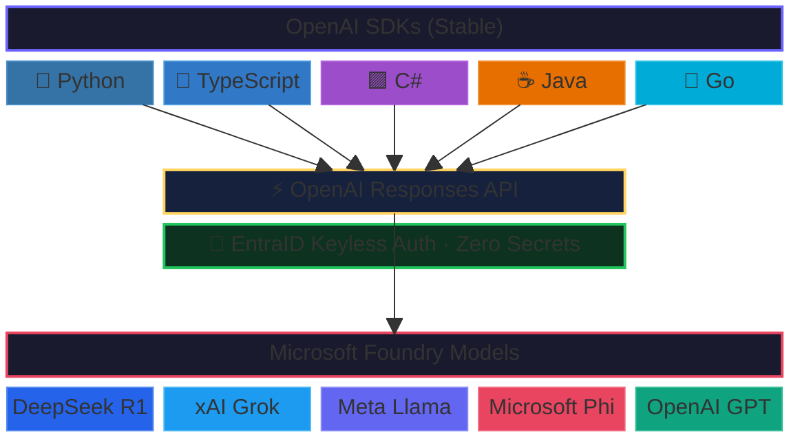

# The AI Model Starter Kit

The fastest way to get started with building apps using **any AI model**.

Call **any Foundry models** — GPT, DeepSeek, Grok, Llama, and more — using **stable OpenAI SDKs** and the **OpenAI Responses API**. Production grade, enterprise friendly and secure with **EntraID keyless authentication** — no API keys, and zero secrets to manage.

Includes working examples in **Python, TypeScript, C#, Java, and Go**.



## Prerequisites

- [Azure Subscription](https://azure.microsoft.com/pricing/purchase-options/azure-account)
- [Azure Developer CLI](https://learn.microsoft.com/azure/developer/azure-developer-cli/install-azd)
- [Azure CLI](https://learn.microsoft.com/cli/azure/install-azure-cli)
- One or more of: Python 3.9+, Node.js 18+, .NET 8+, Java 21+, Go 1.23+

## Quick Start

```bash
# 1. Login to Azure
az login
azd auth login

# 2. Deploy DeepSeek-R1-0528 and gpt-4.1-mini to Microsoft Foundry
azd up
```

That's it! You now have a Microsoft Foundry account with both models deployed and ready to use.

## Next Steps

### Set up your environment

```powershell
# 1. Set the project endpoint environment variable
$env:AZURE_AI_PROJECT_ENDPOINT = azd env get-value 'AZURE_AI_PROJECT_ENDPOINT'

# 2. Assign yourself the Azure AI Developer role
$userId = az ad signed-in-user show --query id -o tsv
$resourceId = "/subscriptions/$(az account show --query id -o tsv)/resourceGroups/rg-$(azd env get-value 'AZURE_ENV_NAME')/providers/Microsoft.CognitiveServices/accounts/$(azd env get-value 'AZURE_AI_FOUNDRY_NAME')"
az role assignment create --role "Azure AI Developer" --assignee $userId --scope $resourceId
```

> **Note:** Role assignments can take up to 5 minutes to propagate. If you see 401/403 errors, wait a few minutes and retry.

### Run an example

Each example calls both an **OpenAI model** (gpt-4.1-mini) and a **non-OpenAI model** (DeepSeek-R1-0528) using the Responses API.

**Python**
```bash
cd src/python
pip install -r requirements.txt
python responses_example.py
```

**TypeScript**
```bash
cd src/typescript
npm install
npx tsx responses_example.ts
```

**C#**
```bash
cd src/csharp
dotnet run
```

**Java** (requires Maven)
```bash
cd src/java
mvn -q compile exec:java
```

**Go**
```bash
cd src/go
go run .
```

### The pattern (every language)

All five examples follow the same pattern:

1. **Get an EntraID token** via `DefaultAzureCredential` (scoped to `https://ai.azure.com/.default`)
2. **Create a standard OpenAI client** with `base_url` = project endpoint + `/openai`
3. **Pass `api-version`** as a query parameter (`2025-11-15-preview`)
4. **Call the Responses API** — works with any deployed model

### Python code sample

```python
import os
from azure.identity import DefaultAzureCredential
from openai import OpenAI

credential = DefaultAzureCredential()
token = credential.get_token("https://ai.azure.com/.default").token

endpoint = os.environ["AZURE_AI_PROJECT_ENDPOINT"]
client = OpenAI(
    base_url=endpoint.rstrip("/") + "/openai",
    api_key=token,
    default_query={"api-version": "2025-11-15-preview"},
)

# Works with any Foundry model — OpenAI, DeepSeek, etc.
response = client.responses.create(
    model="gpt-4.1-mini",  # or "DeepSeek-R1-0528"
    input="Explain quantum computing in simple terms",
    max_output_tokens=1000,
)
print(response.output_text)
```

### The pattern (every language)

All five examples follow the same pattern:

1. **Get an EntraID token** via `DefaultAzureCredential` (scoped to `https://ai.azure.com/.default`)
2. **Create a standard OpenAI client** with `base_url` = project endpoint + `/openai`
3. **Pass `api-version`** as a query parameter (`2025-11-15-preview`)
4. **Call the Responses API** — works with any deployed model

**Why the standard OpenAI SDK?**

The Foundry project endpoint is OpenAI-compatible. By appending `/openai` and passing the `api-version` as a query parameter, you can use the standard `openai` library in any language — no `azure-ai-projects`, `AzureOpenAI`, or `Azure.AI.OpenAI` wrapper needed. This works for all model providers (OpenAI, DeepSeek, Meta, xAI, Microsoft, and more).

## What This Template Includes

- **Core Infrastructure**: Microsoft Foundry account + project with two model deployments
- **Optimal Configuration**: GlobalStandard SKU, flexible region and model selection
- **Secure Authentication**: EntraID (keyless) via `DefaultAzureCredential` — no API keys or secrets to manage
- **Multi-language examples**: Python, TypeScript, C#, Java, and Go — all using their standard OpenAI SDK
- **Complete Documentation**: Setup guide with troubleshooting tips

## What You Get

- **DeepSeek-R1-0528** (default) — High-quality reasoning model, no registration required
- **Flexible model deployment** — Deploy any Foundry model (OpenAI, DeepSeek, Meta, xAI, Microsoft, and more)
- **Microsoft Foundry project** — Full project workspace for your development team
- **Standard OpenAI SDKs** — Use each language's `openai` library directly, no Azure-specific wrappers
- **Responses API support** — Modern API, cleaner than Chat Completions
- **Keyless authentication** — Secure EntraID auth, no API keys to manage
- **Unique resource naming** — No conflicts with existing resources

## Template Structure

```
├── azure.yaml                 # azd configuration
├── infra/
│   ├── main.bicep             # Main deployment template (subscription-scoped)
│   ├── main.parameters.json   # Deployment parameters
│   └── foundry.bicep          # Microsoft Foundry account, project, and model deployments
├── scripts/
│   ├── list_models_with_responses_api_support.py  # Utility: list models supporting the Responses API
│   └── requirements.txt       # Dependencies for scripts (control plane)
├── src/
│   ├── python/
│   │   ├── responses_example.py         # Python example
│   │   └── requirements.txt
│   ├── typescript/
│   │   ├── responses_example.ts         # TypeScript example
│   │   ├── package.json
│   │   └── tsconfig.json
│   ├── csharp/
│   │   ├── Program.cs                   # C# example
│   │   └── FoundryModelsExample.csproj
│   ├── java/
│   │   ├── src/main/java/ResponsesExample.java  # Java example
│   │   └── pom.xml
│   └── go/
│       ├── main.go                      # Go example
│       └── go.mod
└── README.md
```

## Language-specific SDK dependencies

| Language | OpenAI SDK | Azure Identity |
|---|---|---|
| Python | `openai` | `azure-identity` |
| TypeScript | `openai` | `@azure/identity` |
| C# | `OpenAI` (NuGet) | `Azure.Identity` |
| Java | `com.openai:openai-java` | `com.azure:azure-identity` |
| Go | `github.com/openai/openai-go` | `github.com/Azure/azure-sdk-for-go/sdk/azidentity` |

## Configuration

Model deployments are defined in Bicep and created automatically during `azd up`. Configure models via `azd env set` before running `azd up`:

| Variable | Default | Description |
|---|---|---|
| `AZURE_MODEL_NAME` | `DeepSeek-R1-0528` | Primary model to deploy |
| `AZURE_MODEL_FORMAT` | `DeepSeek` | Primary model format (`DeepSeek`, `Microsoft`, `OpenAI`, etc.) |
| `AZURE_MODEL_VERSION` | `1` | Primary model version |
| `AZURE_MODEL_DEPLOYMENT_NAME` | Same as model name | Custom deployment name for primary model |
| `AZURE_MODEL_SKU_NAME` | `GlobalStandard` | Primary model SKU tier |
| `AZURE_MODEL_SKU_CAPACITY` | `10` | Primary model capacity (tokens-per-minute in thousands) |
| `AZURE_MODEL_2_NAME` | `gpt-4.1-mini` | Second model to deploy (empty string to skip) |
| `AZURE_MODEL_2_FORMAT` | `OpenAI` | Second model format |
| `AZURE_MODEL_2_VERSION` | `2025-04-14` | Second model version |
| `AZURE_MODEL_2_DEPLOYMENT_NAME` | Same as model name | Custom deployment name for second model |
| `AZURE_MODEL_2_SKU_NAME` | `GlobalStandard` | Second model SKU tier |
| `AZURE_MODEL_2_SKU_CAPACITY` | `10` | Second model capacity |

### Example: DeepSeek-R1-0528 (Default)

```bash
azd up
```

### Example: gpt-4.1-mini (OpenAI)

```bash
azd env set AZURE_MODEL_NAME "gpt-4.1-mini"
azd env set AZURE_MODEL_FORMAT "OpenAI"
azd env set AZURE_MODEL_VERSION "2025-04-14"
azd up
```

### Example: Phi-4

```bash
azd env set AZURE_MODEL_NAME "Phi-4"
azd env set AZURE_MODEL_FORMAT "Microsoft"
azd up
```

### Example: MAI-DS-R1

```bash
azd env set AZURE_MODEL_NAME "MAI-DS-R1"
azd env set AZURE_MODEL_FORMAT "Microsoft"
azd up
```

## Outputs

After `azd up`, available via `azd env get-values`:

| Output | Description |
|---|---|
| `AZURE_RESOURCE_GROUP` | Resource group name |
| `AZURE_AI_FOUNDRY_NAME` | Microsoft Foundry account name |
| `AZURE_AI_PROJECT_NAME` | Foundry project name |
| `AZURE_AI_PROJECT_ENDPOINT` | Project endpoint URL (use as `base_url` with `/openai` suffix) |
| `AZURE_MODEL_DEPLOYMENT_NAME` | Primary model deployment name |
| `AZURE_MODEL_2_DEPLOYMENT_NAME` | Second model deployment name |

## Common Commands

```bash
# Redeploy with changes
azd up

# Preview what would be deployed
azd provision --preview

# Debug deployment issues
azd up --debug

# Clean up everything
azd down --purge
```

## Alternative Regions

```bash
azd env set AZURE_LOCATION eastus2
azd up
```

## How Do I Find Which Foundry Models Support Responses and Where?

The `scripts/list_models_with_responses_api_support.py` utility queries the ARM control plane to discover which models support the Responses API in your subscription, along with their available regions. See the [full list of supported models](#foundry-models-with-responses-api-support) at the bottom of this page.

```bash
cd scripts
pip install -r requirements.txt

# List all models with Responses API support (OpenAI + non-OpenAI)
python list_models_with_responses_api_support.py

# Show per-region breakdown for models not available everywhere
python list_models_with_responses_api_support.py --locations

# List only non-OpenAI models (DeepSeek, Meta, xAI, etc.)
python list_models_with_responses_api_support.py --non-openai

# Show active model deployments across all Foundry accounts
python list_models_with_responses_api_support.py --deployments

# Combine flags
python list_models_with_responses_api_support.py --non-openai --locations
```

> **Note:** The ARM control plane tags OpenAI-format models with `capabilities.responses`. For non-OpenAI models, `capabilities.agentsV2` is used as a proxy — models with this capability support the Responses API at runtime. The default run combines both into a single unified list.

## Known Issues

| Issue | Summary | Workaround |
|---|---|---|
| ~~[ARM validation rejects non-OpenAI models](https://github.com/Azure-Samples/ai-model-start/issues/4)~~ | ~~Bicep/ARM template deployment previously failed for non-OpenAI model formats.~~ | **Resolved** — Model deployments now work natively in Bicep with API version `2025-06-01`. |
| [Java SDK `putQueryParam` bug](https://github.com/Azure-Samples/ai-model-start/issues/3) | `openai-java` v4.21.0 `putQueryParam("api-version", ...)` silently drops the query parameter, causing `400: API version not supported` errors with EntraID auth. | Wait for an SDK fix. The Java example is included for reference but may not work until this is resolved. |
| [API key endpoint limitation](https://github.com/Azure-Samples/ai-model-start/issues/5) | The account-level API key endpoint (`/openai/v1`) does not support the Responses API for non-OpenAI models. | This template uses **EntraID authentication** with the project endpoint, which supports all models. |

## Troubleshooting

**401 / 403 "Permission denied"** — You need the `Azure AI Developer` role on the Foundry account. Run the role assignment command from [Set up your environment](#set-up-your-environment). Role assignments can take up to 5 minutes to propagate.

**"DeploymentModelNotSupported" during `azd up`** — Ensure the model format matches the model name (e.g., `DeepSeek` format for DeepSeek models, `OpenAI` for GPT models). Check available models with `az cognitiveservices model list -l <location> --query "[?model.format=='YourFormat']"`. See `scripts/list_models_with_responses_api_support.py` for discovery.

**"Quota exceeded"** — Check your subscription's quota for the selected model in the target region. Try a different region or model.

**429 Rate limited** — Increase `AZURE_MODEL_SKU_CAPACITY` or try a different model with more available capacity.

**"api-version is required"** / **"Missing required query string parameter 'api-version'"** — You're using the `/openai` path without passing `api-version`. Add `api-version=2025-11-15-preview` as a query parameter. All examples show how to do this.

**"UnsupportedApiVersion"** — The SDK is sending its default api-version (which isn't supported). Set `api-version=2025-11-15-preview` as a query parameter explicitly.

**Java `400: API version not supported`** — This is a [known SDK bug](https://github.com/Azure-Samples/ai-model-start/issues/3). The Java OpenAI SDK's `putQueryParam` doesn't correctly append the api-version. Wait for an SDK fix.

Need debug info? Run `azd up --debug` for detailed logs.

## Why This Template?

- **Minimal setup** — 2 commands instead of 20+
- **Any Foundry model** — Access OpenAI, DeepSeek, Meta, xAI, Microsoft, and more
- **Any language** — Python, TypeScript, C#, Java, and Go examples included
- **Modern API** — Uses the Responses API, not legacy Chat Completions
- **Standard SDKs** — Uses each language's OpenAI SDK directly, no Azure-specific wrappers
- **Production-ready** — GlobalStandard SKU, EntraID auth, proper naming
- **Secure by default** — Keyless EntraID authentication with Azure Identity
- **Easy cleanup** — Remove everything with `azd down --purge`

## Foundry Models with Responses API Support

All models currently available on Microsoft Foundry that support the [Responses API](https://platform.openai.com/docs/api-reference/responses), queried via the ARM control plane. Last updated: **February 2026**.

### OpenAI

| Model | Version(s) | Availability |
|---|---|---|
| codex-mini | 2025-05-16 | eastus2, swedencentral |
| gpt-4 | 0613 | All except southeastasia |
| gpt-4-32k | 0613 | 20/23 regions |
| gpt-4.1 | 2025-04-14 | All regions |
| gpt-4.1-mini | 2025-04-14 | All regions |
| gpt-4.1-nano | 2025-04-14 | All regions |
| gpt-4o | 2024-05-13, 2024-08-06, 2024-11-20 | All regions |
| gpt-4o-mini | 2024-07-18 | All regions |
| gpt-4o-mini-realtime-preview | 2024-12-17 | eastus2, swedencentral |
| gpt-5-chat | 2025-08-07, 2025-10-03 | eastus2, swedencentral |
| gpt-5-mini | 2025-08-07 | All regions |
| gpt-5-nano | 2025-08-07 | All except canadacentral |
| gpt-5.1-chat | 2025-11-13 | 8/23 regions |
| gpt-5.1-codex-mini | 2025-11-13 | 8/23 regions |
| gpt-5.2-chat | 2025-12-11 | eastus2, swedencentral |
| o1 | 2024-12-17 | All regions |
| o3-deep-research | 2025-06-26 | norwayeast, westus |
| o3-mini | 2025-01-31 | All regions |
| o4-mini | 2025-04-16 | All regions |

### Anthropic

| Model | Version(s) | Availability |
|---|---|---|
| claude-haiku-4-5 | 20251001 | eastus2, swedencentral |
| claude-opus-4-1 | 20250805 | eastus2, swedencentral |
| claude-opus-4-5 | 20251101 | eastus2, swedencentral |
| claude-opus-4-6 | 1 | eastus2, swedencentral |
| claude-sonnet-4-5 | 20250929 | eastus2, swedencentral |
| claude-sonnet-4-6 | 1 | eastus2, swedencentral |

### DeepSeek

| Model | Version(s) | Availability |
|---|---|---|
| DeepSeek-R1-0528 | 1 | All except southeastasia |
| DeepSeek-V3-0324 | 1 | All except southeastasia |
| DeepSeek-V3.1 | 1 | All except southeastasia |
| DeepSeek-V3.2 | 1 | All except southeastasia |
| DeepSeek-V3.2-Speciale | 1 | All except southeastasia |

### Meta

| Model | Version(s) | Availability |
|---|---|---|
| Llama-3.3-70B-Instruct | 1, 2, 3, 4, 5 | All except southeastasia |
| Llama-4-Maverick-17B-128E-Instruct-FP8 | 1 | All except southeastasia |

### Microsoft

| Model | Version(s) | Availability |
|---|---|---|
| MAI-DS-R1 | 1 | All except southeastasia |

### OpenAI-OSS

| Model | Version(s) | Availability |
|---|---|---|
| gpt-oss-120b | 1 | All except southeastasia |

### xAI

| Model | Version(s) | Availability |
|---|---|---|
| grok-3 | 1 | All except southeastasia |
| grok-3-mini | 1 | All except southeastasia |
| grok-4-fast-non-reasoning | 1 | All except southeastasia |
| grok-4-fast-reasoning | 1 | All except southeastasia |

**Region availability notes:**
- **20/23 regions** — `gpt-4-32k` is not available in `japaneast`, `southeastasia`, `westeurope`
- **8/23 regions** — `gpt-5.1-chat` and `gpt-5.1-codex-mini` are available in `australiaeast`, `canadaeast`, `eastus2`, `japaneast`, `koreacentral`, `swedencentral`, `switzerlandnorth`, `uksouth`

> Run `python scripts/list_models_with_responses_api_support.py` for the latest data from your own subscription.

---

Powered by [Azure Developer CLI](https://aka.ms/azd) | Deploy any model on [Microsoft Foundry](https://ai.azure.com)
